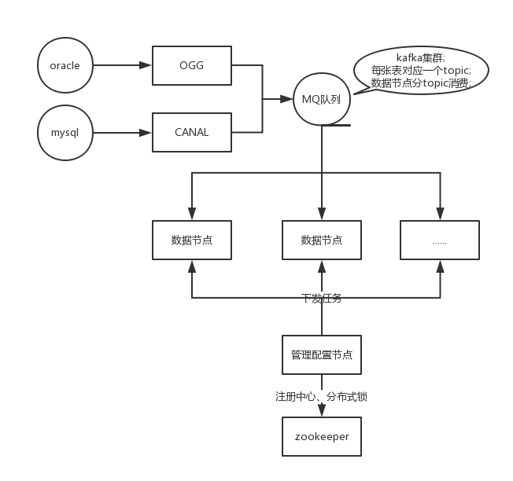

# 数据同步工具 | [English](**)

## Abstract

## Core features

## Document
+ [中文文档](./doc/document.md)
+ [英文文档](./doc/)

## Architecture

+ [架构设计](./doc/architecture.md)
+ [分布式集群](./doc/scale.md)

## code of conduct

## Live Demo

## Screenshot

+ [使用手册](./doc/manager_manual.md)

## Compiling project
+ [快速开始](./doc/quick_start.md)
+ [部署需求](./doc/requirement.md)
+ [配置文档](./doc/profiles.md)

## Contact Us

