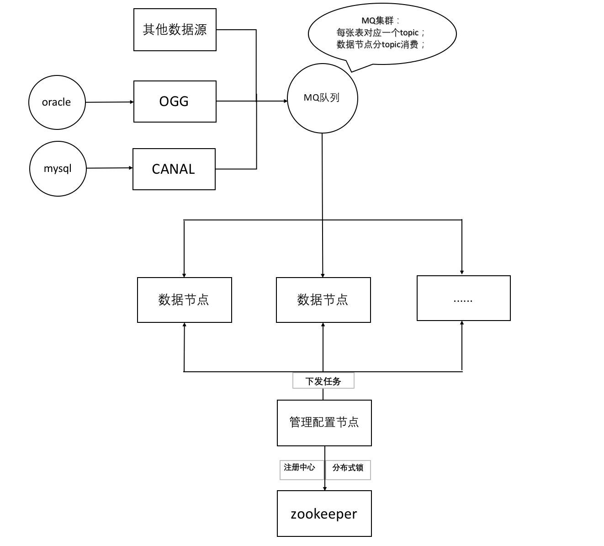
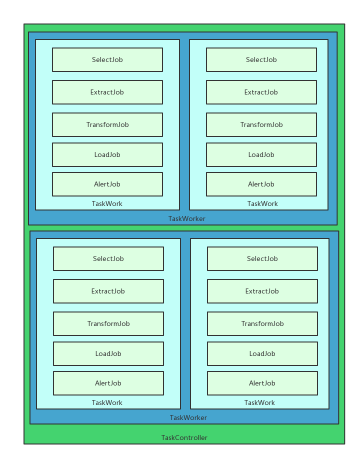

# Porter | [中文](./README.md)

[](https://github.com/sxfad/porter)
[](https://www.apache.org/licenses/LICENSE-2.0.html)


## Abstract

Porter began in 2017 and provides data synchronization, but it's not just limited to data synchronization, it's widely used within the Suixingpay. Mainly provide the following features:

+ Database real-time synchronization
+ Database migrate
+ Database governance
+ Custom source and target data synchronization
+ Custom data extraction logic
 


## Core features

+ Native support Oracle|Mysql to Jdbc relational database final consistent synchronization
+ Plugin friendly, Support for custom source consumer plugins, target loading plugins, and alarm plugins for secondary development.
+ Support for custom source, target table, field mapping
+ Support configuration file based node synchronization task configuration.
+ Support management of background synchronization task push, node, task management. Provides task running indicator monitoring, node running logs, and task abnormal alarms.
+ Support node resource limit and allocation.
+ A distributed architecture based on the Zookeeper cluster plugin. Support for custom cluster plugins.

## Quick start

### Compile from source
```
git clone https://github.com/sxfad/porter.git
cd vbill-proter
git checkout version
gradle build
Find the installation package from the build/distributions list
```

### Run
```
tar zxvf build/distributions/porter-boot-version.tar
porter-boot-version/bin/startup.sh
```

### Debug
```
porter-boot-version/bin/startup.sh  debug port
```
### Operating environment
```
porter-boot-version/bin/startup.sh --spring.profiles.active=Operating environment
```
### Elegant close
```
porter-boot-version/bin/shutdown.sh
```

## Document

+ [中文文档](./doc/document.md)
+ [English document](./doc/document_EN.md)

## Architecture





## Screenshot


+ [Manager Manual](./doc/manager_manual.md)


## Contact Us

* QQ group：835209101


