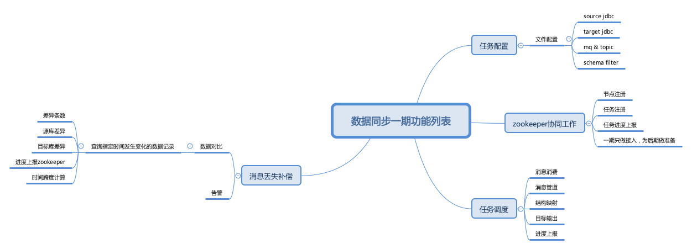
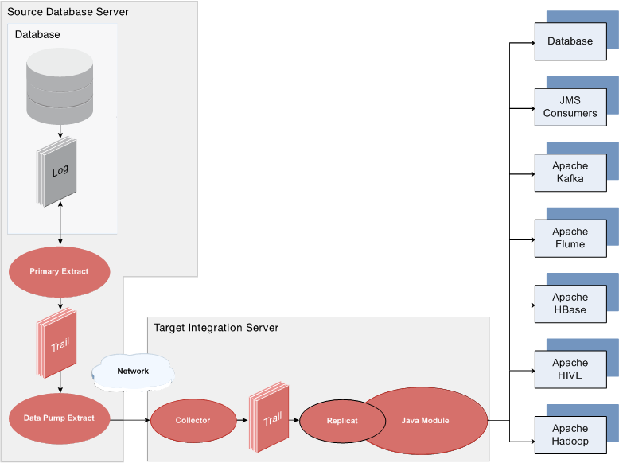

# Architecture Model

## Applicable scene
- Final consensus
- One-way synchronization

## Realization basis
- MQ Message Sequence consumption
- Messages in the MQ message group are consumed at most once
- Only supports DML, DDL、DCL manual execution
- Table must have primary key、last update time

## System architecture



## Node Memory model

```
TaskController 1---* TaskWorker
TaskWorker 1---* TaskWork
TaskWork 1---1 *Job
Popularly speaking, TaskController corresponds to the Node process, there is only one in the process; TaskWorker corresponds to the task, Each task corresponds to a Worker;
Each task which has a plurality of conduits, namesd TaskWork,corresponds to the MQ topic; Each Work has multiple phased tasks.
In terms of the whole, This is a pipeline filter style architectural pattern.
SelectJob single thread consumes data from a data source
ExtractJob single thread reads data from the Select queue, multithreading extract data.
TrasnformJob single thread reads data from the Extract memory collection，Multi-threaded mapping conversion data.
LoadJob single thread loads data into the database according to the order of the SelectJob consumption.
AlertJob, the single-thread synchronous Zookeeper database checks the time point and compares the data entry differences between the source database and the target database in the specified time period.
Alarms are configured according to the alarm mode configured in the configuration file.
```

## OGG deployment structure



## Problem & Solution(Phenomenon description and compensation)
- MQ distribution problem
    - Different source databases spit into different MQ clusters.
    - Broker cluster storage, topic only allows unique partitions.
    - Each table individually corresponds to a topic.
    - 消息消费节点集群分主题消费
    - Message consumption node only consumes messages, no complex business logic.
    - Manually control the progress of message production.
- Data consistency problem
    - Final consistency
    - Message loss
        - Target record is inconsistent with source record.
            - The last insert、update message is missing.
                - The target database lags behind the source database.
            - Last delete message lost.
                - Target database redundant dirty data.
        - Message condition does not match the target database.
            - No insert messages,just have update and delete message.
                - Insert according to the latest value.
                - No need to delete actions.
            - Primary key change condition matching.
                - Update the latest value based on the primary key.
            - Primary key change conditions do not match.
                - Target database insert the new primary key, the old primary key redundant dirty data.
    - Message loss solution
        - Select data records that have not changed recently.
            - Over time, the data set has changed, there is no way to perform task segmentation based on time, nor can it accumulate historical task execution results.
        - Select data records that change at a specified time.
            - Record the initial synchronization time.
            - According to a reasonable time span, target database and source database data records for a specified time span before the current time node.
            - Cumulative completed data comparison time.
