# 使用手册

[//]: # (todo)
## 例1
```
	业务需求: 同步mysql数据表c_role、c_department到oracle数据表DATA_ROLE、DATA_DEPARTMENT中;c_role表中id字段数值在同步中+1000.
	数据准备: 
		来源数据信息:
			mysql数据源
				url：jdbc:mysql://172.16.60.247:3306/data_test?useUnicode=true&characterEncoding=utf8
				用户名：fd
				密码：123456
			同步数据来源(canal)
				地址：172.16.60.247:3306
				数据库：data_test
				用户：fd
				密码：123456	
				过滤器：data_test\.(c_role|c_department)
		目标数据信息
			oracle数据源
				url：jdbc:oracle:thin:@172.16.134.250:1521:test  
				用户名：test234  
				密码：123456
	自定义代码:
		public class CustomKeyProcessor implements EventProcessor {
		
		    private Logger log = LoggerFactory.getLogger(CustomKeyProcessor.class);
		    
		    @Override
		    public void process(ETLBucket etlBucket) {
		        List<ETLRow> rows = etlBucket.getRows();
		        for (ETLRow row : rows) {
		            log.info("自定义逻辑Schema:[{}]   table:[{}]",row.getFinalSchema(),row.getFinalTable());
		            if (row.getFinalTable().equalsIgnoreCase("c_role")) {
		                for (ETLColumn eTLColumn : row.getColumns()) {
		                    log.info("自定义逻辑Column:[{}]",eTLColumn.getFinalName());
		                    if(eTLColumn.getFinalName().equalsIgnoreCase("ID")){
		                        log.info("自定义逻辑value:[{}]",eTLColumn.getFinalValue());
		                        eTLColumn.setFinalValue(Long.valueOf(eTLColumn.getFinalValue())+1000l+"");;
		                    }
		                }
		            }
		        }
		    }
		}
```

### 第一步:创建数据来源数据库、同步数据来源、目标数据库
+ **数据源管理界面**
    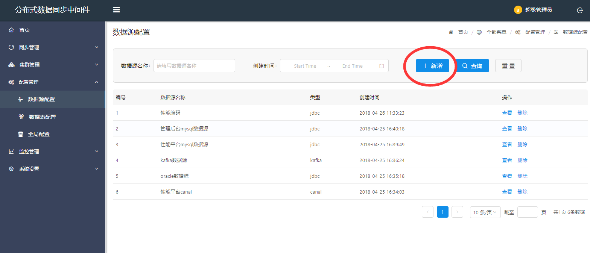
    * 建议尽可能减少重复数据源的创建。
+ **创建来源数据库**
    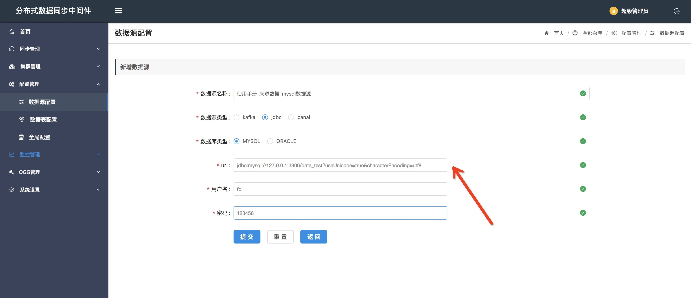
    * 请合理进行数据源命名，保证直观易识别；
    * mysql数据源请加后缀**?useUnicode=true&characterEncoding=utf8**；
    * mysql服务器需要开启binlog，登陆用户需具备dba权限。
+ **创建同步数据来源(canal)**
    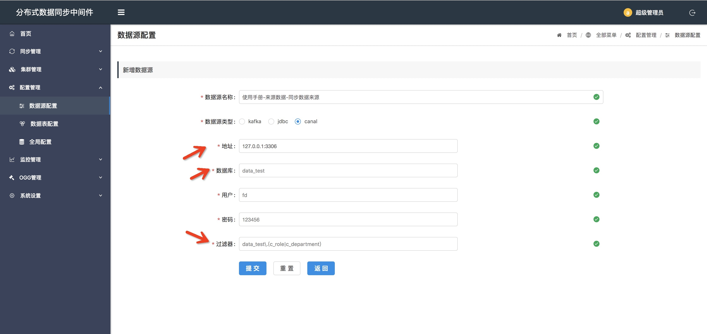
    * mysql数据库用做来源数据的时候，请配置canal数据源。
    * 配置canal数据源的时候请按照正则格式添加过滤器，如data_test\.(c_role|c_department)
    
[//]: # (todo)
+ **创建目标数据库**
    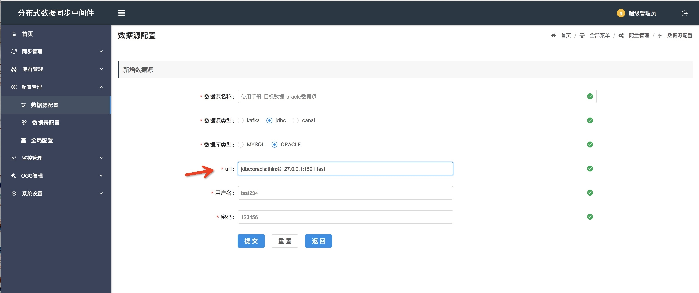
    * oracle作为目标数据源，需要用户具备相关表DML语句权限。
+ **列表页面**
    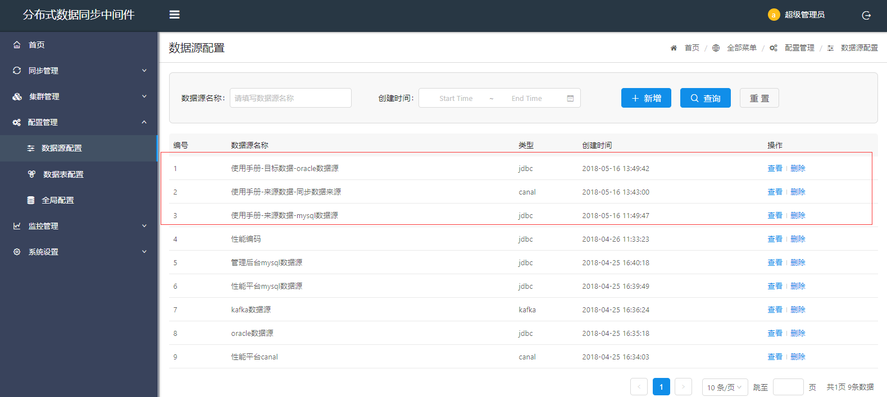
    * 理论上任务需要三个数据源，分别是来源数据源、目标数据源、数据来源插件（canal）。
### 第二步：创建来源数据表组、目标数据表组
+ **数据表管理界面**
    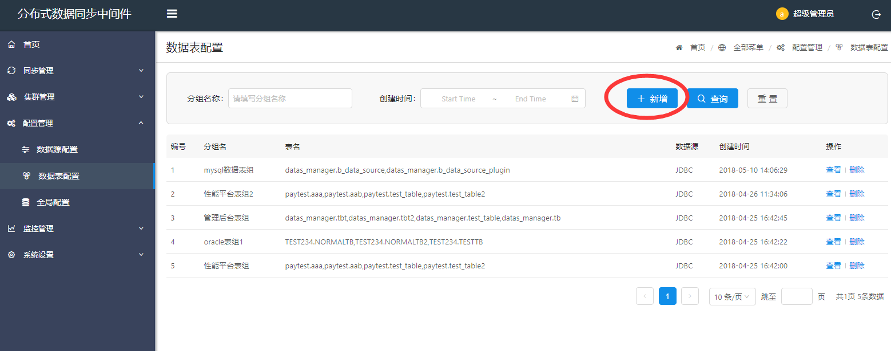
+ **创建来源数据表组**
    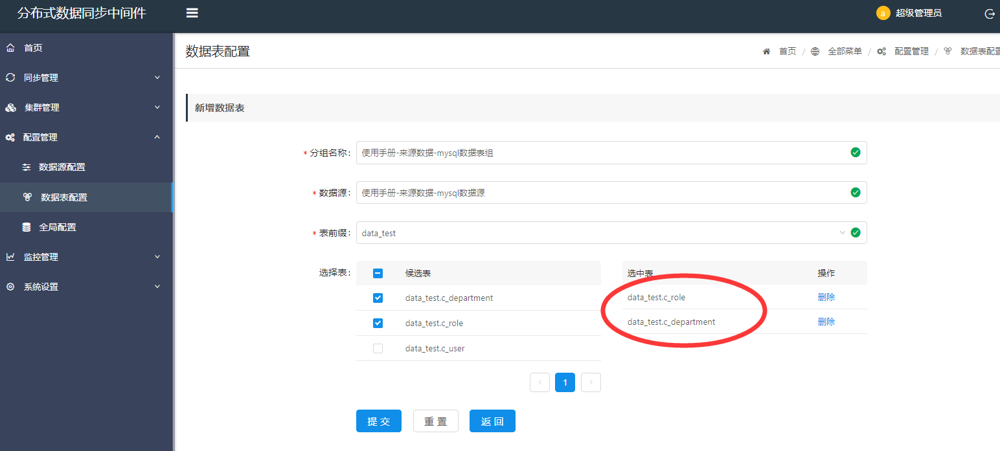
    * mysql数据库，前缀是数据库名称。
    
[//]: # (todo)
+ **创建目标数据表组**
    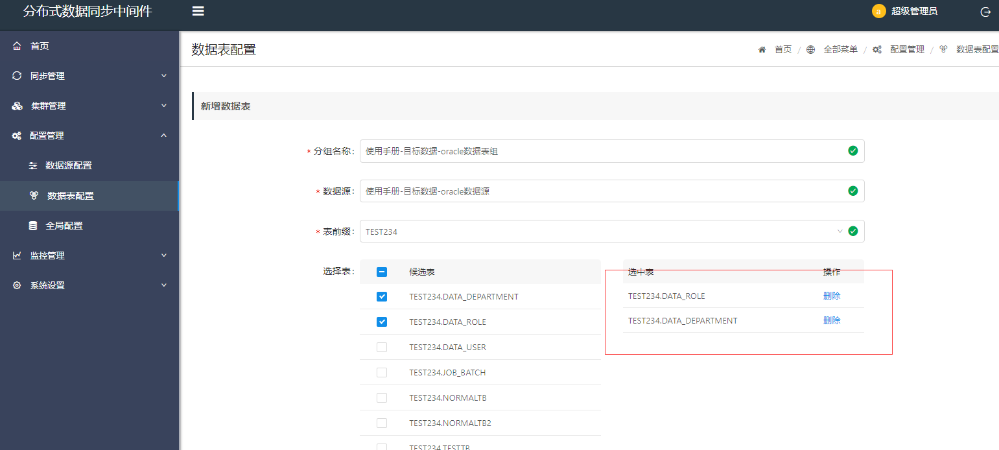
    * oracle数据库，前缀是用户名称。
+ **列表页面**
    
    * 理论上任务需要一对数据表组，分别是来源表组，目标表组。

### 第三步 查看同步节点
+ **节点管理页面**
    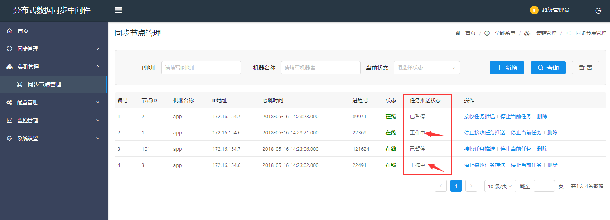
    * 请注意，node-boot节点启动后，推送状态处于暂停中，需要在此节点运行任务，需要开启；
    * 请注意，node-boot节点的启动、关闭必须使用shell脚本，禁用kill -9,kill方式关闭会导致zk信息不删除，影响重启;
    * 请注意，停止接收任务推送，不会影响节点已运行任务；
    * 请注意，停止当前任务，不会影响节点接收任务。

### 第四步 创建同步任务
+ **任务管理页面**
    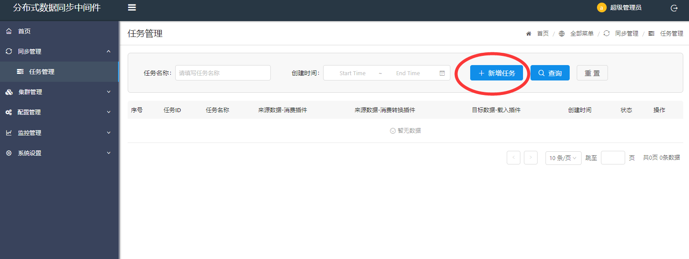
+ **创建任务**
    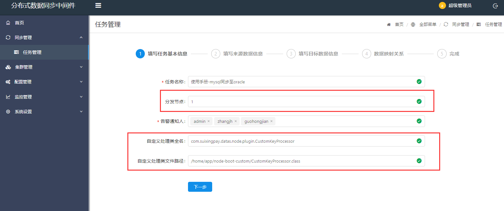
    * 请注意，任务名称不允许修改；
    * 请注意，分发节点不选择或者选择多个的情况下，节点谁抢到任务谁运行；
    * 请注意，自定义处理类信息由业务部门自己编写，需要把编译后.class文件上传到运行任务的节点服务器；
    * 请注意，告警通知人会在任务异常停止的时候收到邮件警告，邮箱地址是用户管理的注册邮箱。
    
    * 请注意，mysql作为来源数据，必须选择器canal相关插件、格式；
    * 请注意，mysql作为来源数据，同步数据来源现阶段只能选择canal类型。
    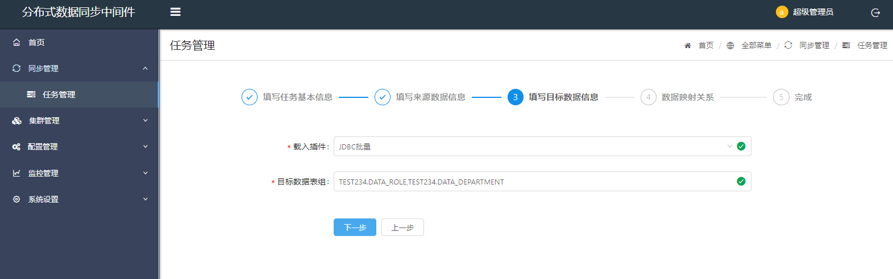
    * 请注意，**载入插件**影响的是最终sql拼装方式。
    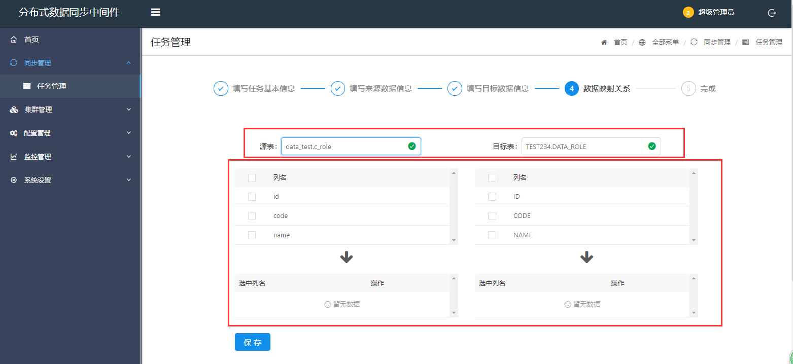
    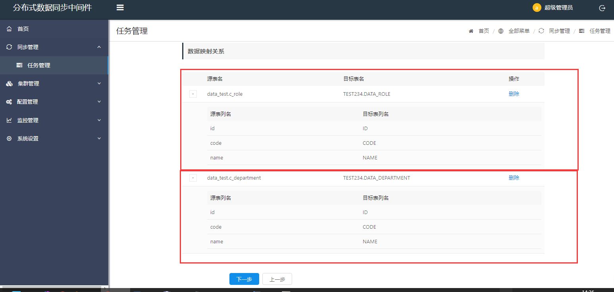
    * 请注意，表映射关系只能新建、删除，不提供修改功能；
    * 请注意，表映射关系在任务第二三步变更后，进行清空操作；
    * 请注意，表映射关系现阶段支持一对一、多对一、一对多操作；
    * 请注意，表映射关系不能进行重复保存；
    * 请注意，字段映射现阶段仅支持一对一严格映射；
+ **启动任务**
    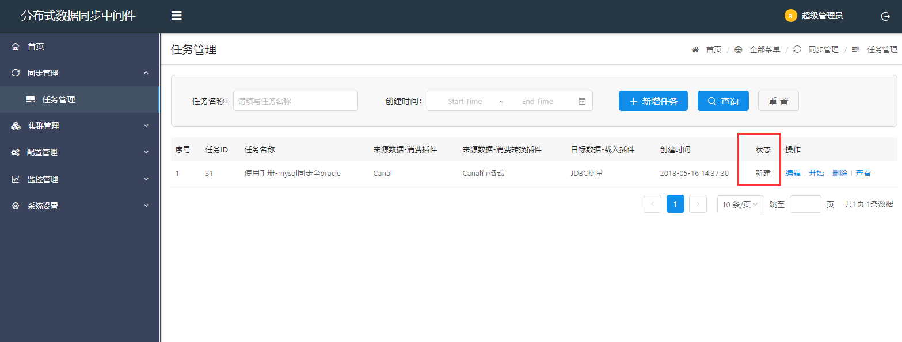
    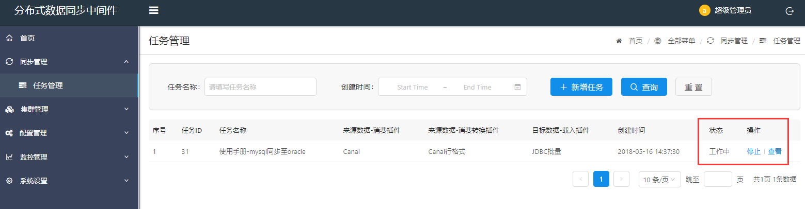
    * 请注意，运行中任务禁止任何变革；
    * 请注意，任务推送数据存放于zk中，数据的变革必须在任务停止后进行。
    * 请注意，任务启动后，如果存在配置错误，任务会立即停止；
    * 请注意，任务运行的节点，必须处于接收任务状态；

### 第五步 节点监控、任务监控、日志监控
+ **节点监控**
    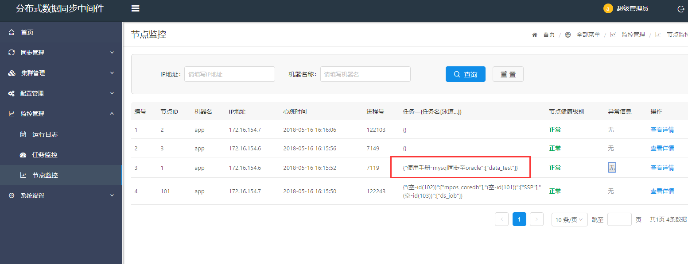
    * 请注意，节点中只要有一个任务存在问题，就会发出节点警告展示；
    * 请注意，节点的统计数据是节点所有任务数据的集合。
    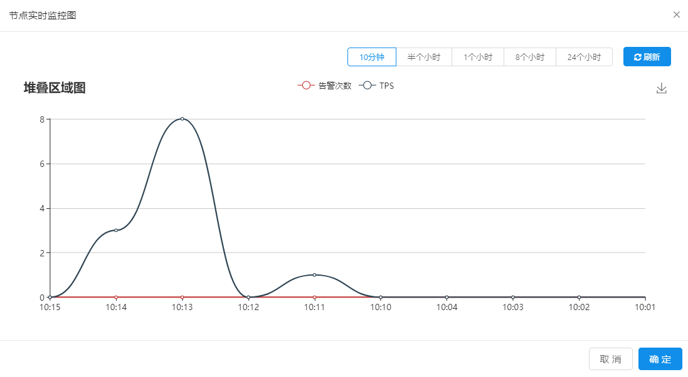
    * 请注意，实时数据最多进行24个小时的查询，需查询24小时之前数据请联系架构部技术创新组。
+ **任务监控**
    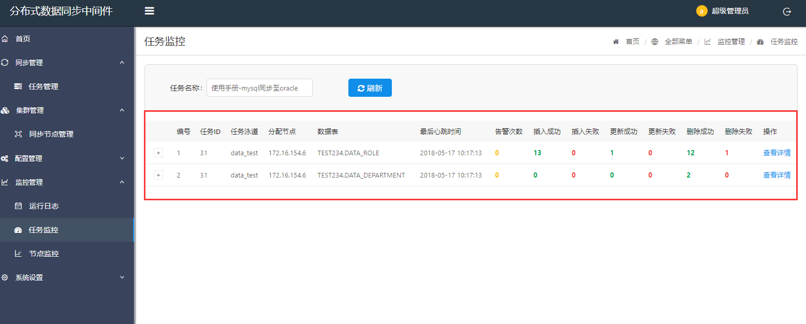
    * 请注意，任务监控数据按照目标表进行最小单位整理统计；
    * 请注意，一个任务可能存在多个泳道，一个泳道可能跑多张表的同步。
    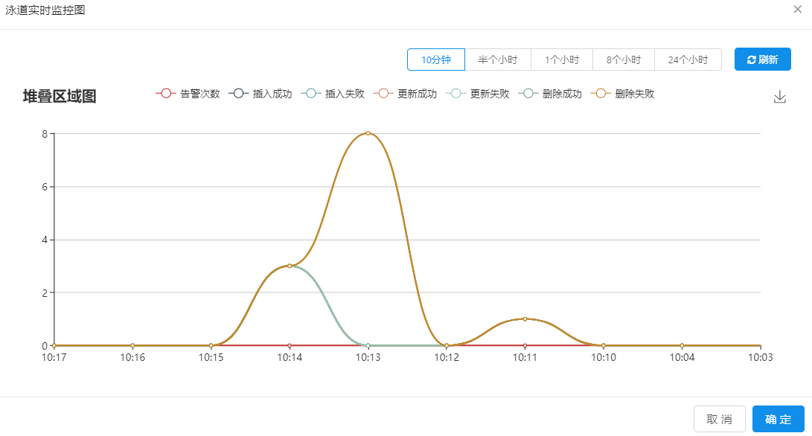
    * 请注意，实时数据最多进行24个小时的查询，需查询24小时之前数据请联系架构部技术创新组。
+ **日志监控**
    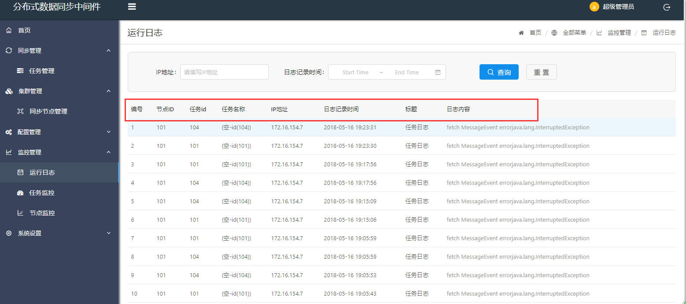
    * 请注意，理论上**任务停止告警**是和邮件告警同步就行。
### 第六步 数据库数据
+ **来源数据**
    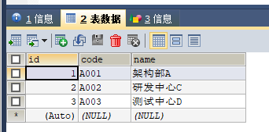
    * 请注意，canal读取binlog数据，默认从任务创建后开始，如需其他位置点，请人工介入。
+ **目标数据**
    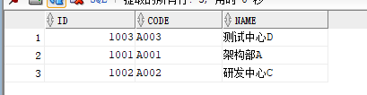
    * 请注意，业务要求ID增加了1000.

[//]: # (todo)
## 例2
```
	业务需求: 同步oracle数据表DATA_USER到mysql数据表c_user中.
	数据准备: 
		来源数据信息:
			oracle数据源
				url：jdbc:oracle:thin:@172.16.134.250:1521:test
				用户名：test234
				密码：123456
			同步数据来源(kafka)
				服务器列表：172.16.154.5:9092,172.16.154.7:9092
				主题：test234
				查询超时时间：5000
				单次查询数量：1000
		目标数据信息
			mysql数据源
				url：jdbc:mysql://172.16.60.247:3306/data_test?useUnicode=true&characterEncoding=utf8
				用户名：fd
				密码：123456
```

### 第一步:创建数据来源数据库、同步数据来源、目标数据库
+ **数据源管理界面**
    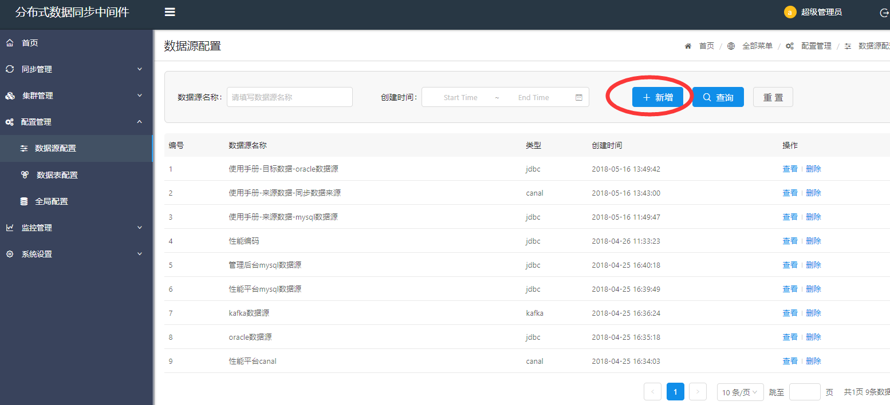
    * 建议尽可能减少重复数据源的创建。
    
[//]: # (todo)
+ **创建来源数据库**
    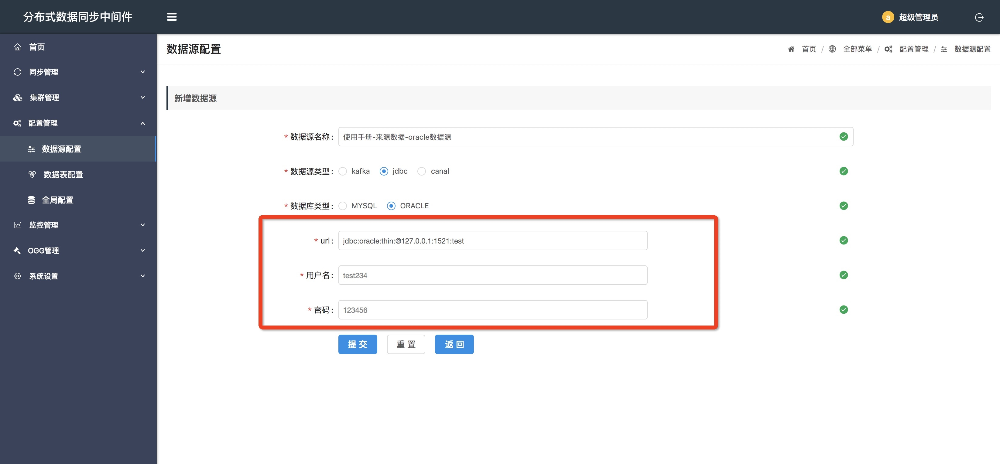
    * 请合理进行数据源命名，保证直观易识别；
    * oracle服务器需要开启归档日志，登陆用户需具备dba权限。
    
[//]: # (todo)
+ **创建同步数据来源(kafka)**
    
    * 请注意，oracle数据库用做来源数据的时候，请配置kafka数据源；
    * 请注意，ogg的配置需要dba协助完成；
    * 请注意，多服务器、多主题的情况下请用英文,隔开。
+ **创建目标数据库**
    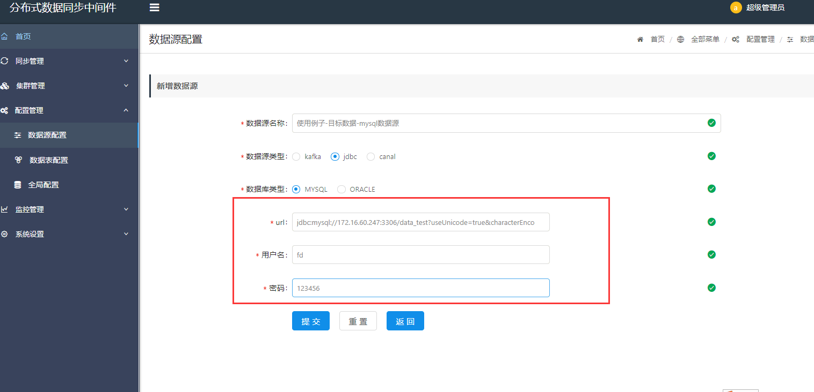
    * mysql作为目标数据源，需要用户具备相关表DML语句权限。
    * mysql数据源请加后缀**?useUnicode=true&characterEncoding=utf8**；
+ **列表页面**
    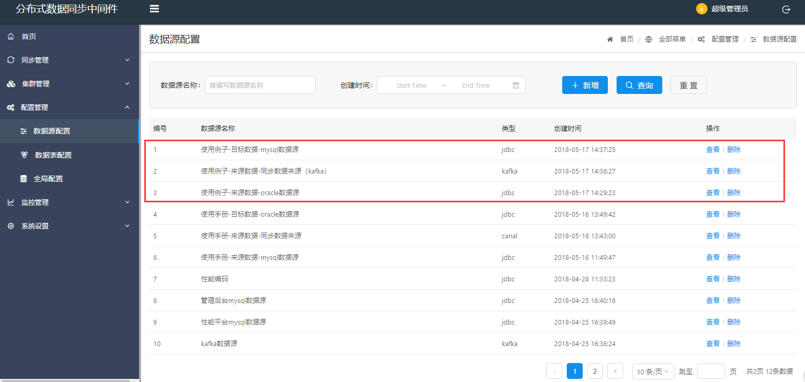
    * 理论上任务需要三个数据源，分别是来源数据源、目标数据源、数据来源插件（kafka）。
### 第二步：创建来源数据表组、目标数据表组
+ **数据表管理界面**
    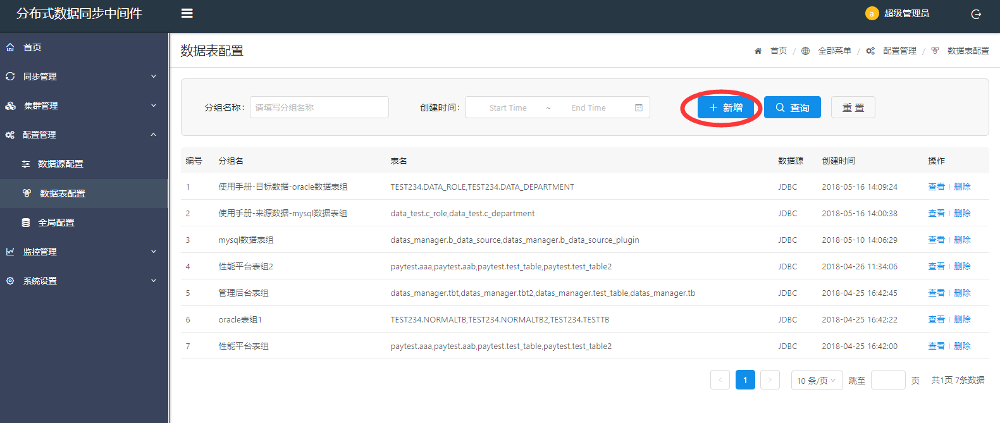
    
[//]: # (todo)
+ **创建来源数据表组**
    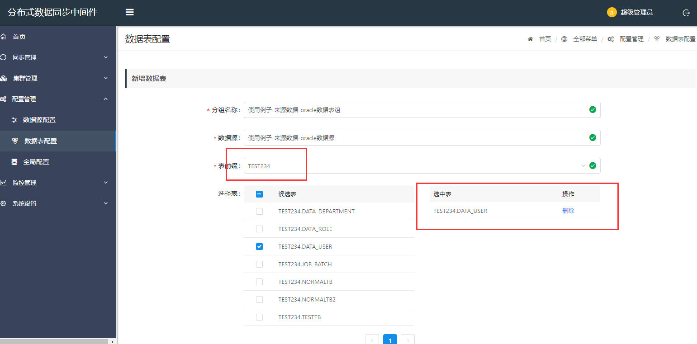
    * oracle数据库，前缀是用户名称。
+ **创建目标数据表组**
    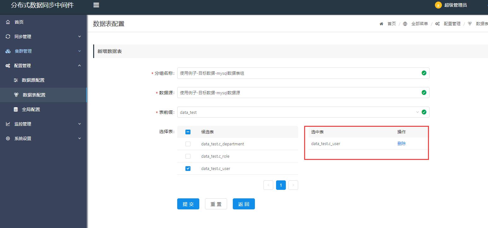
    * mysql数据库，前缀是数据库名。
+ **列表页面**
    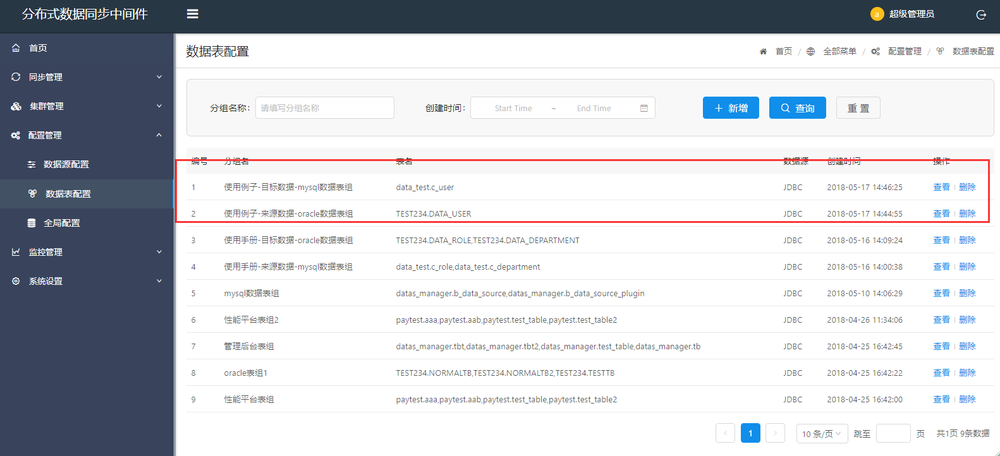
    * 理论上任务需要一对数据表组，分别是来源表组，目标表组。

### 第三步 查看同步节点
+ **节点管理页面**
    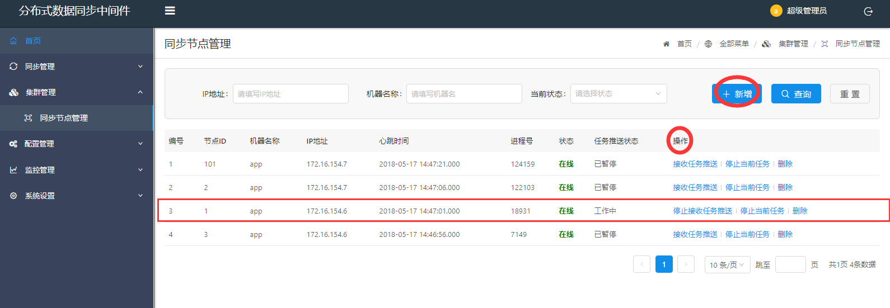
    * 请注意，node-boot节点启动后，推送状态处于暂停中，需要在此节点运行任务，需要开启；
    * 请注意，node-boot节点的启动、关闭必须使用shell脚本，禁用kill -9,kill方式关闭会导致zk信息不删除，影响重启;
    * 请注意，停止接收任务推送，不会影响节点已运行任务；
    * 请注意，停止当前任务，不会影响节点接收任务。

### 第四步 创建同步任务
+ **任务管理页面**
    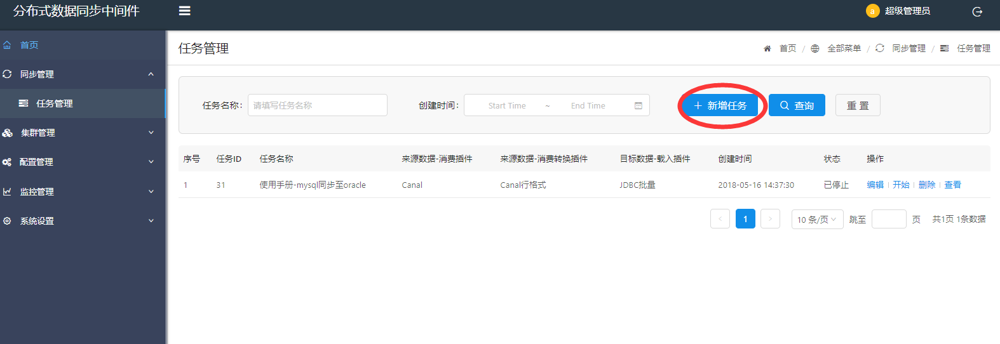
+ **创建任务**
    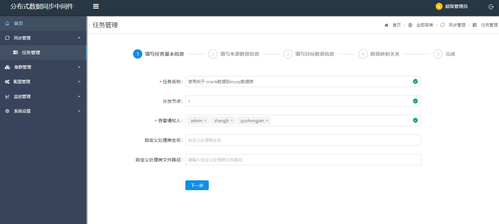
    * 请注意，任务名称不允许修改；
    * 请注意，分发节点不选择或者选择多个的情况下，节点谁抢到任务谁运行；
    * 请注意，告警通知人会在任务异常停止的时候收到邮件警告，邮箱地址是用户管理的注册邮箱。
    
[//]: # (todo)
    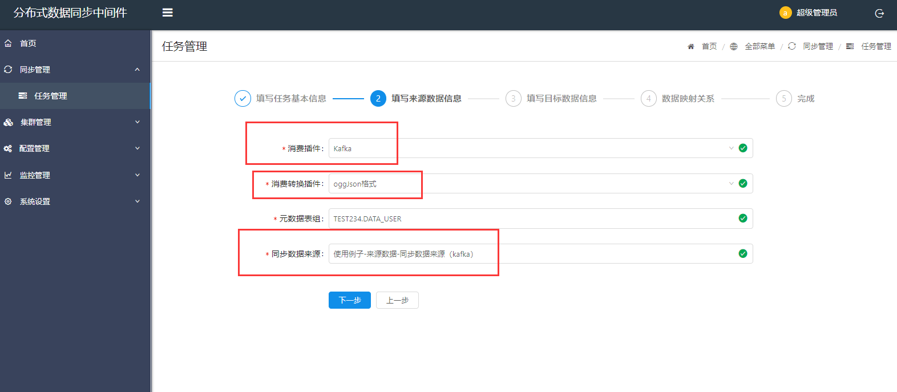
    * 请注意，oracle作为来源数据，必须选择器kafka相关插件、ogg格式；
    * 请注意，oracle作为来源数据，同步数据来源现阶段只能选择kafka类型。
    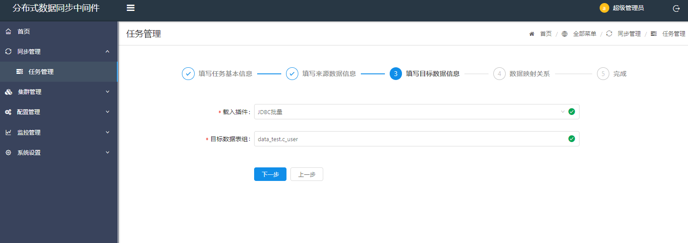
    * 请注意，**载入插件**影响的是最终sql拼装方式。
    
    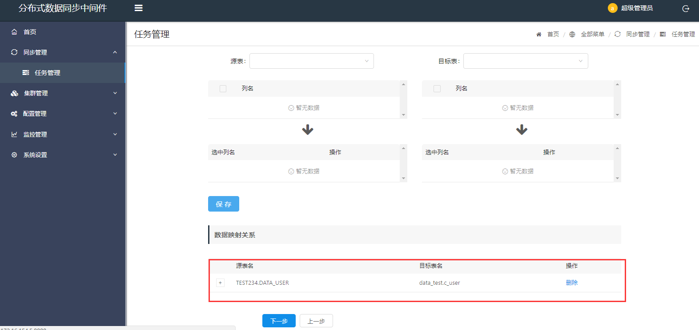
    * 请注意，表映射关系只能新建、删除，不提供修改功能；
    * 请注意，表映射关系在任务第二三步变更后，进行清空操作；
    * 请注意，表映射关系现阶段支持一对一、多对一、一对多操作；
    * 请注意，表映射关系不能进行重复保存；
    * 请注意，字段映射现阶段仅支持一对一严格映射；
+ **启动任务**
    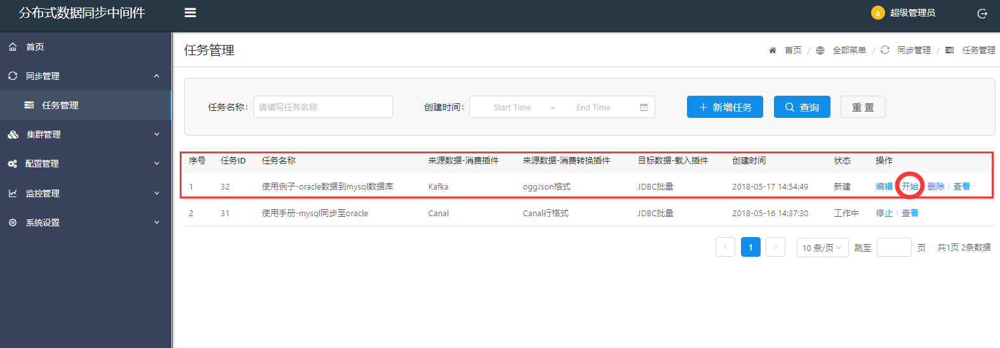
    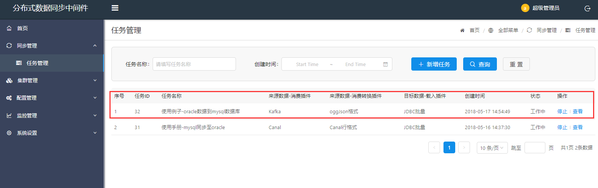
    * 请注意，运行中任务禁止任何变革；
    * 请注意，任务推送数据存放于zk中，数据的变革必须在任务停止后进行。
    * 请注意，任务启动后，如果存在配置错误，任务会立即停止；
    * 请注意，任务运行的节点，必须处于接收任务状态；

### 第五步 节点监控、任务监控、日志监控
+ **节点监控**
    
    * 请注意，节点中只要有一个任务存在问题，就会发出节点警告展示；
    * 请注意，节点的统计数据是节点所有任务数据的集合。
    
    * 请注意，实时数据最多进行24个小时的查询，需查询24小时之前数据请联系架构部技术创新组。
+ **任务监控**
    
    * 请注意，任务监控数据按照目标表进行最小单位整理统计；
    * 请注意，一个任务可能存在多个泳道，一个泳道可能跑多张表的同步。
    
    * 请注意，实时数据最多进行24个小时的查询，需查询24小时之前数据请联系架构部技术创新组。
+ **日志监控**
    
    * 请注意，理论上**任务停止告警**是和邮件告警同步就行。
### 第六步 数据库数据
+ **来源数据**
    
+ **目标数据**
    
