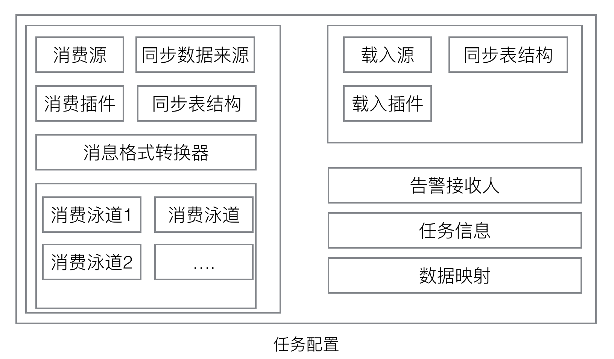

# 配置文档
## 兼容性
```
	兼容v0.3.2+，包括v0.3.2
```
<!--
## 结构

-->
## 文档结构

- config/application.properties

```
	spring-boot配置文件，可配置运行环境(spring.profiles.active)等，详情参考spring-boot官方文档。
	同样可通过porter-boot脚本指定上述参数,例如 porter-boot --logging.level.root=debug
```

- config/application-${env}.properties

```
	spring-boot配置文件，不同运行环境的配置文件。
```


- config/tasks/${env}/*.properties

```
	任务配置文件
	不同的环境(${env})的任务配置在config/tasks目录的不同子目录。
```


- 日志生成目录

```
	spring-boot配置参数，默认logging.file=${app.home}/logs/data-porter.log。
	其中${app.home}是在启动脚本中指定的，指的是datas-porter的根目录
```

## 节点编号

- porter.id

```
	用于指定任务节点编号，在所属分布式环境中唯一。用于自描述并在zookeeper上报心跳、实现分布式锁。
	eg.
		porter.id=100
```


## 统计
- porter.statistic.upload

```
	是否上传统计信息，包括日志、TPS指标.
	类型:Boolean
```

 
## 集群
### porter.cluster

```
	分布式集群实现，当前仅支持zookeeper
	详细配置在ClusterConfig.java
```


- porter.cluster.strategy

```
	指定分布式集群的实现策略 
	候选项:ZOOKEEPER、STANDALONE
	eg.
		porter.cluster.strategy=ZOOKEEPER
```

- porter.cluster.client.url

```
	集群连接参数
	ZOOKEEPER模式参数
	eg.
		porter.cluster.client.url=127.0.0.1:2181
```

- porter.cluster.client.sessionTimeout

```
	集群连接超时时间
	ZOOKEEPER模式参数
	eg.
		porter.cluster.client.sessionTimeout=超时时间，单位为毫秒。
```

- porter.cluster.client.home

```
	元信息存储目录
	STANDALONE模式参数
	eg.
		porter.cluster.client.home=路径
```

- porter.cluster.statistic

```
    统计指标数据上传目标端链接信息,默认上传到zookeeper。当上传到zookeeper时，manager-cluster无需部署
    eg.
    porter.cluster.statistic.sourceType=KAFKA_PRODUCE
    porter.cluster.statistic.servers=127.0.0.1:9200
    porter.cluster.statistic.topic=kafka主题
```

## 告警
### porter.alert

```
 	告警策略驱动，当前仅支持邮件
```

- porter.alert.strategy

```
	指定告警方式
	候选项:EMAIL、NONE
	eg.
		porter.alert.strategy=EMAIL
```

- porter.alert.frequencyOfSeconds

```
	相同内容通知接收频率
	eg.
		porter.alert.frequencyOfSeconds=60
```

- porter.alert.client

```
	porter.alert.client.host=smtp服务器
	porter.alert.client.username=邮箱
	porter.alert.client.password=密码	
	porter.alert.client.smtpAuth=true
	porter.alert.client.smtpStarttlsEnable=true
	porter.alert.client.smtpStarttlsRequired=false
```

- porter.alert.receiver

```
	全局告警通知人
	类型：ArrayList
	porter.alert.receiver[index].realName=姓名
	porter.alert.receiver[index].email=邮箱
	porter.alert.receiver[index].phone=手机号
```

## 公用连接池

```
	当多个任务目标端和源端共用数据库连接池时配置，用于节省数据库链接资源。
	类型:Map
	
```


### porter.source.命名名字
- porter.source.命名名字.sourceType

```
	源类型
	类型:enum
	可选参数:JDBC
```


- porter.source.命名名字.url

```
	多个用逗号隔开
	eg.
		porter.source.命名名字.url=jdbc连接
```

- porter.source.命名名字.userName

```
	账户名
	eg.
		porter.source.命名名字.userName=账户
```

- porter.source.命名名字.password

```
	密码
	eg.
		porter.source.命名名字.password=密码
```

- porter.source.命名名字.maxWait
- porter.source.命名名字.minPoolSize
- porter.source.命名名字.maxPoolSize
- porter.source.命名名字.initialPoolSize
- porter.source.命名名字.connectionErrorRetryAttempts

```
	连接错误重试次数
	类型:Int
```
[//]: # (todo)
- porter.source.命名名字.dbType

```
	类型:Enum
	可选参数:MYSQL、		ORACLE
```

- porter.source.命名名字.makePrimaryKeyWhenNo(<font color='red'>2.0.1新增</font>)

```
	类型:Boolean
	当目标端表无主键时，默认全部字段为主键
	默认true
```


## 任务配置
###  porter.task
```
	节点任务
	类型:ArrayList
```

- porter.task[index].taskId

```
	任务编号
	类型:String
	eg. 
		porter.task[index].taskId=1
```

- porter.task[index].receiver

```
	当前任务告警通知人
	任务告警会通知到porter.task[index].receiver + porter.alert.receiver
	类型：ArrayList
	porter.task[index].receiver[index].realName=姓名
	porter.task[index].receiver[index].email=邮箱
	porter.task[index].receiver[index].phone=手机号
```

- porter.task[index].consumer

```
	任务消费源配置
	类型:DataConsumerConfig
```	

- porter.task[index].consumer.consumerNameme	

```
		消费器插件
		类型:String
		可选择参数:CanalFetch、KafkaFetch
```

- porter.task[index].consumer.converter

```
		消息转换器
		类型:String
		可选择参数:canalRow(1.0新增)、oggJson
```

- porter.task[index].consumer.source

```
	消费器数据来源
	类型:Map
	
	CanalFetch：(1.0新增)
	porter.task[index].consumer.source.sourceType=CANAL
	porter.task[index].consumer.source.slaveId=mysql slaveId
	porter.task[index].consumer.source.address=ip:port
	porter.task[index].consumer.source.database=数据库名
	porter.task[index].consumer.source.username=账户
	porter.task[index].consumer.source.password=密码
	porter.task[index].consumer.source.filter=订阅表正则
	
	KafkaFetch:
	porter.task[0].consumer.source.sourceType=KAFKA
	porter.task[0].consumer.source.servers=ip:port,ip:port
	porter.task[0].consumer.source.topics=主题
	porter.task[0].consumer.source.group=消费分组
	porter.task[0].consumer.source.autoCommit=true|false
	porter.task[0].consumer.source.partition=分区,默认0(3.0新增)
	
```

- porter.task[index].consumer.metaSource


```
	元数据数据源
	类型:Map
	不做配置时，将不会做源端与目标端数据一致对比。(1.1新增规则)
	形式1：
	porter.task[index].consumer.metaSource.sourceName=公共数据源名字
	
	形式2:
	porter.task[index].consumer.metaSource.dbType
	porter.task[index].consumer.metaSource.url
	porter.task[index].consumer.metaSource.userName
	porter.task[index].consumer.metaSource.password
	porter.task[index].consumer.metaSource.maxWait
	porter.task[index].consumer.metaSource.minPoolSize
	porter.task[index].consumer.metaSource.maxPoolSize
	porter.task[index].consumer.metaSource.initialPoolSize
	porter.task[index].consumer.metaSource.connectionErrorRetryAttempts
```

- porter.task[index].consumer.eventProcessor.className(1.1新增)

```
	自定义同步数据数据抽取器
	格式:package.className
```

- porter.task[index].consumer.eventProcessor.content(1.1新增)

```
	class路径、jar路径、源码内容
```
- porter.task[index].consumer.eventProcessor.emptyFetchNoticeSpan(<font color='red'>2.0.1新增</font>)

```
	空查询通知间隔,单位秒
	默认3600
```

- porter.task[index].consumer.eventProcessor.emptyFetchThreshold(<font color='red'>2.0.1新增</font>)

```
	空查询通知时间阀值,单位秒
	-1时不生效，默认3600
```


- porter.task[index].loader

```
	任务载入器配置
	类型:DataLoaderConfig
```

- porter.task[index].loader.loaderName

```
	目标端载入器插件
	类型:Enum
	可选参数:JdbcBatch、JdbcSingle
```	

- porter.task[index].loader.source


```
	目标端数据源
	类型:Map
	
	形式1：
	porter.task[index].loader.source.sourceName=公共数据源名字
	
	形式2:
	porter.task[index].loader.source.dbType
	porter.task[index].loader.source.url
	porter.task[index].loader.sourceuserName
	porter.task[index].loader.source.password
	porter.task[index].loader.source.maxWait
	porter.task[index].loader.source.minPoolSize
	porter.task[index].loader.source.maxPoolSize
	porter.task[index].loader.source.initialPoolSize
	porter.task[index].loader.source.connectionErrorRetryAttempts
```

- porter.task[index].loader.insertOnUpdateError(<font color='red'>2.0新增</font>)

```
	目标端更新失败转插入开关参数,默认开启
	类型:Boolean
```

- porter.task[index].mapper

```
	源端与目标端schema映射，用于处理源端和目标端命名不一致的情况
	类型:List
```

- porter.task[index].mapper[下标].schema

```
	porter.task[index].mapper[index].schema=源端schema,目标端schema
```

- porter.task[index].mapper[下标].table

```
	porter.task[index].mapper[index].table=源端表名,目标端表名
```


- porter.task[index].mapper[下标].updateDate

```
	如果不配置或配置错误，数据同步结果检查功能不启用
	porter.task[index].mapper[下标].updateDate=源端表自动更新时间字段,目标端表自动更新时间字段
```

- porter.task[index].mapper[下标].column

```
	字段映射,可不配置。
	porter.task[index].mapper[下标].column.源端字段名=目标端字段名
```