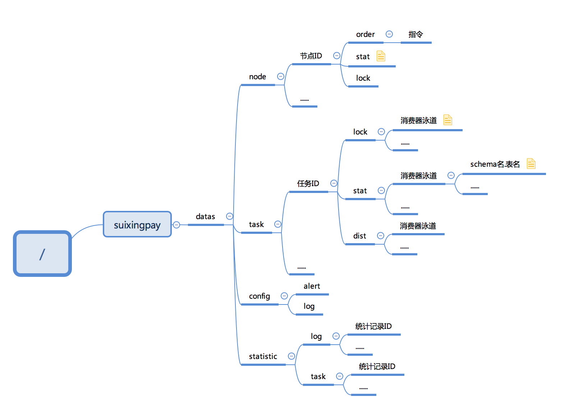

# Distributed cluster

## luster policy plugin
```
	The distributed clustering strategy is implemented in the form of a plugin, published in the form of SPI, and activated through a configuration file.
```

## zookeeper distributed policy

