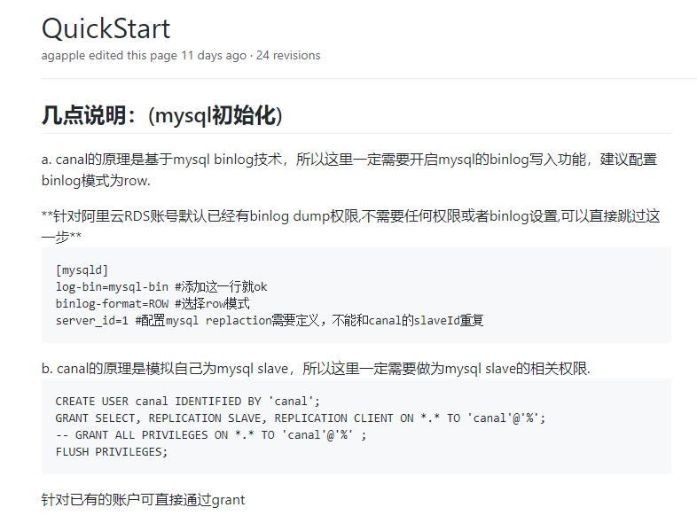

# porter开发环境部署

## 环境要求（单机环境）
+ jdk
+ zookeeper
+ zkui(方便查看zookeeper集群信息)
+ mysql
+ node.js

### 环境配置过程：
1. vmware安装centos(其他linux环境理论上一样，但未测试)，选择NAT模式方便与宿主机联网；
2. 安装jdk(我使用的jdk1.8)
3. 安装zookeeper和zkui
4. 安装node.js(porter-ui需要node环境)
5. 准备mysql服务器，porter-boot同步mysql数据是用到canal组件，请参照canal手册设置mysql账号，
注意：不需要安装canal！只设置mysql binlog格式以及账号和权限。
[canal相关设置](https://github.com/alibaba/canal/wiki/QuickStart)
	

## 源码处理
笔者用到的是idea,已经安装git,gradle;
1. porter源码加载到idea
2. 切换至2.0.2.1稳定版本
3. 配置修改:
    + 添加porter/manager/manager-boot/src/main/resources/application.properties
      ```
        spring.profiles.active = sample
      ```
    + 修改porter/manager/manager-boot/src/main/resources/application-sample.properties
    数据库连接信息(porter管理系统数据源配置):
      ```
      # 注意这里的数据库名称ds_data
      spring.datasource.druid.url=jdbc:mysql://127.0.0.1:3306/ds_data?serverTimezone=Asia/Shanghai&useUnicode=true&characterEncoding=utf-8&useSSL=false&allowMultiQueries=true
      spring.datasource.druid.username=root
      spring.datasource.druid.password=root
      
      # 注意端口号要与porter-ui配置一致（后面会提及）
      server.port=8081
      # log
      logging.file=${app.home}/logs/manager-boot.log
      ```
    + 初始化数据库：修改/porter/manager/manager-boot/src/main/resources/初始化脚本.sql，
        1. 注意这里面第一行“use datas_manager;”错误，需与jdbc连接信息一致；
        2. 409行“CHARSET=utf8 COMMENT='ogg表数据信息'”结尾少了分号(";")；
        3. 创建ds_data数据库，执行修改后的sql脚本；
    + 注释掉/porter/porter/porter-boot/src/main/resources/tasks/sample/task.sample.properties中的所有配置，这里的任务会在启动porter-boot时加载，后续也可以再管理页面添加，这里不做配置；
    + 添加/porter/porter/porter-boot/src/main/resources/application.properties配置文件
        ```
        spring.profiles.active = sample
        logging.level.org.apache.kafka=INFO
        logging.level.org.apache.zookeeper=INFO
        logging.level.org.apache.commons.beanutils=INFO
        logging.level.org.springframework=INFO
        logging.level.org.springframework.jdbc.support.SQLErrorCodeSQLExceptionTranslator=DEBUG
        
        logging.file=${app.home}/logs/data-node.log
        # 端口
        server.port=8080
        server.context-path=/api
        ```
    + 配置警告邮件信息，运行出错时会发送邮件提醒
        ```
        修改文件/porter/porter/porter-boot/src/main/resources/application-sample.properties
        node.statistic.upload=true
        ```
4. 构建项目
    + 点击idea右侧Gradle插件，选择porter(root)/Tasks/build/build
    + 待构建完成，拷贝/porter/porter/porter-boot/build/distributions/porter-boot-2.0.2.1.tar
    和/porter/manager/manager-boot/build/distributions/manager-boot-2.0.2.1.tar两个压缩包至/app/soft/porter/(看情况，自己指定)
5. 配置管理UI
    + 下载源码（https://github.com/sxfad/porter-ui.git）
    + 修改/porter-ui/local/local-ajax-base-url.js,注意此处端口为前面manager-boot指定的端口
        ```
        export default 'http://IP:8081/api/manager';
        ```
    + 修改/porter-ui/ajax-config.js
        ```
        'dev': 'http://IP:8081/api/manager'
        ```
    + 修改/porter-ui/builder/config.js(只做开发环境配置，这里的端口是页面访问端口)
        ```
        dev: {
                env: '"development"',
                port: 8082,
                assetsSubDirectory: 'static',
                assetsPublicPath: '/',
                // CSS Sourcemaps off by default because relative paths are "buggy"
                // with this option, according to the CSS-Loader README
                // (https://github.com/webpack/css-loader#sourcemaps)
                // In our experience, they generally work as expected,
                // just be aware of this issue when enabling this option.
                cssSourceMap: false
            }
        ```
    + 复制修改后的porter-ui项目至服务器/app/soft/porter
6. 启动准备
目前/app/soft/porter/目录下有三个项目：porter-ui,manage-boot,porter-boot
    + 启动zookeeper,启动zkui
    + 解压manage-boot-2.0.2.1.tar
    + 解压porter-boot-2.0.2.1.tar
    + 启动manage-boot
        ```
        ./manage-boot-2.0.2.1/bin/manager-boot
        ```
    + 启动前端(启动后不要ctrl+c退出命令行，后续操作请再创建窗口)
        ```
        cd /porter-ui
        # 安装依赖
        yarn
        # 启动
        yarn run dev
        ```
        现在浏览器输入IP:8082，admin/admin可登陆管理系统
    + 启动porter-boot
        ```
        ./porter-boot-2.0.2.1/bin/porter-boot 
        ```
       启动后在/集群管理/同步节点管理中可以看到2019节点
7. 恭喜你，到这里就部署完成了
#### 注意： 项目关闭或启动出错时，请登录zkui，清除一下suixingpay节点的数据再启动
#### 项目启动顺序建议：清理集群信息 -> 启动manager-boot -> 启动porter-ui -> 启动porter-boot
